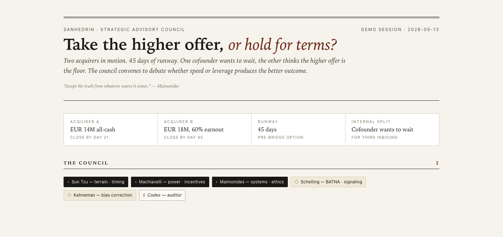

# Sanhedrin

A Claude Code skill that turns one-shot AI advice into structured adversarial strategy.

> *"Accept the truth from whatever source it comes"* -- Maimonides

<p align="center">
  
</p>

<p align="center"><em>A session ends with a single self-contained HTML report you can re-read, share, or paste back into Claude Code.</em></p>

- **Blind memos** -- advisors write independently before seeing each other's work
- **Cross-examination** -- every strategy gets steelmanned and attacked on structure
- **Mandatory "do nothing"** -- inaction is always evaluated as an explicit option

## Install

```bash
git clone https://github.com/Bambushu/sanhedrin ~/.claude/skills/sanhedrin
```

Verify it loaded:

```
/sanhedrin
```

You should see "Sanhedrin convened" in your terminal.

**Optional:** Codex integration adds the audit step (probability bands, pre-mortems, decision trees). Sanhedrin works without it.

## Quick start

```
/sanhedrin
I have two acquisition offers, 45 days of runway, and a cofounder who wants to wait.
What should we do?
```

```
/sanhedrin
My employer offered 15% raise to stay. A competitor is offering 40% more
but the role is lateral. I have 5 days to decide.
```

```
/sanhedrin wargame
Our main competitor just undercut us on pricing by 30%. We have 6 months
more runway than they do. CEO wants to match their price immediately.
```

## What makes this different

**Blind memos.** Five advisors write independent analyses in parallel. No advisor sees another's work until all memos are in. This prevents anchoring and groupthink. When five frameworks converge on the same answer without coordination, that signal is worth something.

**Cross-examination.** Every strategy gets steelmanned by a rival and attacked on structure: faulty incentive assumptions, ignored second-order effects, poor timing, reputational blowback. Generic objections are not allowed. No "it depends."

**Mandatory "do nothing" row.** The audit always evaluates inaction as an explicit option. This prevents action bias -- the default tendency to do *something* even when waiting is correct.

**Preserved dissent.** If Maimonides says a strategy is effective but corrosive, or Akiva sees a hidden opportunity the majority dismissed, their position is preserved in the final counsel. Minority views are often the most valuable signal.

From the demo:

> *"The unlicensed casino thinks it is offering you money. It is actually showing you a map. Read the map."*

That is the kind of counsel Sanhedrin produces. Not a generic recommendation, but a reframing that changes what you are deciding.

## How it works

```
Briefing        You describe the situation. Sanhedrin extracts objective,
                counterpart, deadline, stakes, BATNA, constraints.

Blind memos     5 advisors write independent analyses in parallel.
                No advisor sees another's work.

Clustering      Overlapping recommendations are grouped into 2-3
                distinct strategic options.

Cross-exam      Each advisor steelmans one rival strategy and attacks
                another. No hedging. No "it depends."

Intervention    You challenge advisors, add information, swap roster
                members, or trigger wargame mode.

Audit           An independent auditor pressure-tests everything:
                probability bands, assumption tables, pre-mortems,
                decision trees, and a mandatory "do nothing" row.

Final counsel   Recommended move, fallback, tripwires, first action
                today, and any preserved dissent.

HTML report     A self-contained HTML artifact of the full session
                saved to ~/sanhedrin-reports/, with interactive
                tripwire checkboxes and a copy-as-prompt button.
```

## The council

Seven personas total. Five are active per session: three permanent members and two dynamic picks based on what you are facing.

### Always present

**Sun Tzu** -- Terrain, timing, indirect strategy
*"Where is the enemy weak? What battle should you avoid entirely?"*
Calm, indirect, metaphorical. Prefers asymmetric positions where downside is limited. Deeply skeptical of urgency.

**Machiavelli** -- Power dynamics, incentives, appearances
*"What do they actually want? What would happen if you did nothing?"*
Pragmatic, unsentimental, direct. Separates stated reasons from actual incentives. Cuts through self-deception.

**Maimonides** -- Systems thinking, ethics, sustainability
*"What is the sustainable path? Where is the balance between principle and pragmatism?"*
The ethical anchor. If the recommended move is effective but destructive to reputation, his dissent is prominently displayed even if he is outvoted.

### Dynamic roster

Two are chosen automatically by situation type, or override with `Roster: akiva, talleyrand`.

**Thomas Schelling** -- Bargaining, signaling, BATNA
*"What signals are you sending? What commitment would change the game?"*
Best for: negotiations, contracts, salary, counter-offers.

**Daniel Kahneman** -- Cognitive bias, base rates, calibration
*"What's the base rate? How confident should you really be?"*
Best for: any situation where overconfidence or loss aversion might be distorting the analysis.

**Talleyrand** -- Coalition dynamics, political survival
*"Who actually has power right now? How do you make yourself indispensable to them?"*
Best for: org politics, restructurings, layoffs, alliance-building.

**Rabbi Akiva** -- Persistence, reinvention, hidden opportunity
*"What opportunity is hidden in this difficulty? What could this become if you persist?"*
Best for: moments of doubt, pivots, rebuilding, starting over.

## Wargame mode

For decisions with an active opponent. Sanhedrin builds an opponent model (their incentives, constraints, BATNA, public vs private posture), validates it with the council, then simulates moves and counter-moves in a structured table.

```
/sanhedrin wargame
[your situation + what you know about the opponent]
```

Three or more advisors flagging the same gap in the opponent model will halt the simulation and ask you to fill it. No wargame runs on a weak model.

## Requirements

- [Claude Code](https://docs.anthropic.com/en/docs/claude-code)
- Codex integration (optional -- adds the audit step with probability bands and decision trees)

## Contributing

Issues and pull requests welcome. If you build an interesting persona, open a PR to `agents/`.

The skill is designed so new personas follow the same template: lens, voice, core question, behavioral constraints, risk tolerance, evidence standards, and the blind memo schema. See any file in `agents/` for the pattern.

## License

MIT
